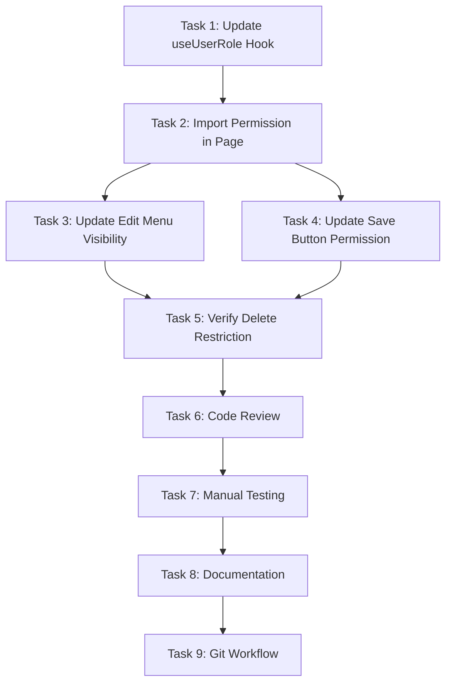

# Implementation Tasks

**Change ID:** `enable-orgclerk-edit-permissions`

This document outlines the implementation tasks required to enable OrganizationClerk users to edit organization details, aligning the UI with the documented Permission Matrix in the PRD.

## Task Checklist

### 1. Update useUserRole Hook - Add Edit Organization Permission

**File:** `src/hooks/useUserRole.ts`

- [x] Add new permission constant `canEditOrganizationDetails` (after line 92)
- [x] Set value to `isOrganizationAdmin || isOrganizationClerk`
- [x] Export the new permission in the return statement (around line 116)
- [x] Add JSDoc comment explaining the permission

**Code Location:**
```typescript
// Around line 92, add:
const canEditOrganizationDetails = isOrganizationAdmin || isOrganizationClerk;

// Around line 116, in return statement:
return {
  // ... existing exports
  canEditOrganizationDetails,  // ADD THIS LINE
};
```

**Validation:**
- Verify TypeScript compiles without errors
- Verify hook exports the new permission
- Check that both OrganizationAdmin and OrganizationClerk roles evaluate to true
- Check that other roles evaluate to false

### 2. Update Organization Details Page - Import New Permission

**File:** `src/app/organization/[id]/page.tsx`

- [x] Update the `useUserRole` destructuring to include `canEditOrganizationDetails` (around line 114-116)
- [x] Remove `canManageOrganizationUsers` from destructuring if it's not used elsewhere

**Code Location:**
```typescript
// Around line 114-116:
const {
  canManageOrganizationUsers,
  canEditOrganizationDetails,  // ADD THIS LINE
} = useUserRole(organizationId);
```

**Validation:**
- Verify import statement is correct
- Verify no TypeScript errors
- Ensure the hook is called correctly

### 3. Update Edit Menu Visibility Logic

**File:** `src/app/organization/[id]/page.tsx`

- [x] Replace `canManageOrganizationUsers` with `canEditOrganizationDetails` on line 578
- [x] This controls the visibility of the three-dot menu (MoreVert icon)

**Code Location:**
```typescript
// Line 578, change from:
canManageOrganizationUsers && (

// To:
canEditOrganizationDetails && (
```

**Validation:**
- Menu should be visible for both OrganizationAdmin and OrganizationClerk
- Menu should be hidden for site-level roles
- Verify the menu opens and shows Edit option

### 4. Update Save Button Permission Check

**File:** `src/app/organization/[id]/page.tsx`

- [x] Replace `canManageOrganizationUsers` with `canEditOrganizationDetails` on line 557
- [x] This controls whether the Save Changes button is disabled during edit mode

**Code Location:**
```typescript
// Line 557, change from:
disabled={isLoading || !canManageOrganizationUsers}

// To:
disabled={isLoading || !canEditOrganizationDetails}
```

**Validation:**
- Save button should be enabled for OrganizationClerk
- Save button should work correctly when clicked
- Verify loading state during save operation

### 5. Verify Delete Remains Restricted

**File:** `src/app/organization/[id]/page.tsx`

- [x] Confirm `canDeleteOrganization()` function (line 305-307) remains unchanged
- [x] Verify it still checks for `SystemAdmin` role only
- [x] Ensure delete option is NOT visible to OrganizationClerk

**Validation:**
- OrganizationClerk should NOT see delete option in menu
- Only SystemAdmin role can see delete option
- Delete confirmation dialog should work for authorized users

### 6. Code Review & Quality Checks

- [x] Run linter: `yarn lint`
- [x] Check for TypeScript errors: `npx tsc --noEmit` (if requested)
- [x] Search codebase for other uses of `canManageOrganizationUsers` in organization editing context
- [x] Verify no unused imports
- [x] Ensure consistent code formatting
- [ ] Check for console errors in browser DevTools

**Search Commands:**
```bash
# Find other potential uses of canManageOrganizationUsers for org editing
rg "canManageOrganizationUsers" src/app/organization/

# Verify the new permission is exported correctly
rg "canEditOrganizationDetails" src/
```

### 7. Manual Testing

#### Test Setup
- Create test users with different roles in the system:
  - User A: OrganizationAdmin role
  - User B: OrganizationClerk role
  - User C: SiteAdmin role (for comparison)

#### Test Cases

**Test 1: OrganizationClerk - View Edit Menu**
- [ ] Login as OrganizationClerk (User B)
- [ ] Navigate to `/organization/{orgId}`
- [ ] Verify three-dot menu (MoreVert icon) is visible in organization details card
- [ ] Click the menu
- [ ] Verify "Edit" option appears
- [ ] Verify "Delete" option does NOT appear (restricted to SystemAdmin)

**Test 2: OrganizationClerk - Edit Organization Details**
- [ ] Login as OrganizationClerk (User B)
- [ ] Navigate to organization details page
- [ ] Click three-dot menu → Edit
- [ ] Verify form enters edit mode with all fields editable:
  - Organization Name
  - Description
  - Email
  - Phone
  - Segments
- [ ] Modify organization name (e.g., add "- Updated" suffix)
- [ ] Modify description
- [ ] Add or remove a segment
- [ ] Click "Save Changes"
- [ ] Verify success message appears
- [ ] Verify changes are persisted (reload page and check)
- [ ] Verify no console errors

**Test 3: OrganizationClerk - Cancel Edit**
- [ ] Login as OrganizationClerk (User B)
- [ ] Enter edit mode
- [ ] Make changes to fields
- [ ] Click "Cancel"
- [ ] Verify form exits edit mode
- [ ] Verify changes are NOT saved

**Test 4: OrganizationAdmin - Permissions Unchanged**
- [ ] Login as OrganizationAdmin (User A)
- [ ] Navigate to organization details page
- [ ] Verify three-dot menu is visible
- [ ] Click menu
- [ ] Verify "Edit" option appears
- [ ] If User A has SystemAdmin role, verify "Delete" option appears
- [ ] Test edit functionality works as before

**Test 5: SiteAdmin - No Edit Access**
- [ ] Login as SiteAdmin (User C)
- [ ] Navigate to organization details page
- [ ] Verify three-dot menu is NOT visible
- [ ] Verify organization details are displayed in read-only mode

**Test 6: API Permission Verification**
- [ ] Login as OrganizationClerk
- [ ] Open browser DevTools → Network tab
- [ ] Edit and save organization details
- [ ] Verify PUT request to `/api/v1/organizations/{orgId}` succeeds (status 200/204)
- [ ] Verify no 403 Forbidden errors
- [ ] Check response confirms changes were saved

#### Cross-Browser Testing
- [ ] Test in Chrome
- [ ] Test in Firefox
- [ ] Test in Edge
- [ ] Test in Safari (if applicable)

### 8. Documentation Updates

**File:** `docs/Lawsome_PRD.md`

- [ ] Verify Permission Matrix (line 509) shows OrganizationClerk can "Edit org details" (✓)
- [ ] No changes needed - PRD is already correct
- [ ] Optionally add a note in Change Log documenting this UI fix

**Optional Change Log Entry:**
```markdown
| Version | Date | Changes |
|---------|------|---------|
| 1.2 | January 24, 2025 | Fixed UI to allow OrganizationClerk to edit organization details as documented in Permission Matrix. Previously, edit functionality was incorrectly restricted to OrganizationAdmin only. |
```

### 9. Git Workflow

- [ ] Ensure working on `feature/openspecintegration` branch or create new feature branch
- [ ] Stage changes: `git add src/hooks/useUserRole.ts src/app/organization/[id]/page.tsx`
- [ ] Commit with descriptive message referencing OpenSpec change ID
- [ ] Push to remote
- [ ] Create pull request with link to this OpenSpec proposal

**Suggested Commit Message:**
```
fix: enable OrganizationClerk to edit organization details

- Add canEditOrganizationDetails permission flag to useUserRole hook
- Update organization details page to use new permission for edit menu visibility
- Align UI behavior with documented Permission Matrix in PRD
- Delete functionality remains restricted to SystemAdmin only

OpenSpec Change ID: enable-orgclerk-edit-permissions
```

## Task Dependencies



### Sequential Dependencies
- Task 1 must be completed before Task 2
- Tasks 3 and 4 can be done in parallel after Task 2
- Task 7 (Manual Testing) requires all code changes (Tasks 1-5) to be complete
- Task 9 (Git Workflow) should be done last after all validation

### Parallelizable Tasks
- After Task 2 is complete, Tasks 3 and 4 can be done simultaneously
- Task 6 (Code Review) can run in parallel with early stages of Task 7 (setup)

## Rollback Plan

If issues arise after deployment:

1. **Quick Rollback:** Revert the commit that added `canEditOrganizationDetails`
2. **Partial Rollback:**
   - Remove `canEditOrganizationDetails` from page component
   - Restore `canManageOrganizationUsers` permission checks
   - Keep hook changes but don't use the new permission
3. **No Data Impact:** This is a UI-only change; no database or backend changes
4. **Emergency Fix:** If critical issue found, disable edit menu for OrganizationClerk by adding temporary role check

## Definition of Done

- [ ] OrganizationClerk can see and click the edit menu on organization details page
- [ ] OrganizationClerk can edit and save organization details (name, description, email, phone, segments)
- [ ] Delete option remains hidden from OrganizationClerk (SystemAdmin only)
- [ ] OrganizationAdmin permissions remain unchanged
- [ ] No TypeScript or linting errors
- [ ] All manual test cases pass
- [ ] Code reviewed and approved
- [ ] Changes committed and pushed to remote
- [ ] Pull request created (if applicable)

## Estimated Effort

- **Development**: 30 minutes (simple permission flag addition)
- **Testing**: 1 hour (manual testing with multiple roles)
- **Code Review**: 15 minutes
- **Documentation**: 15 minutes (optional PRD update)
- **Total**: ~2 hours
