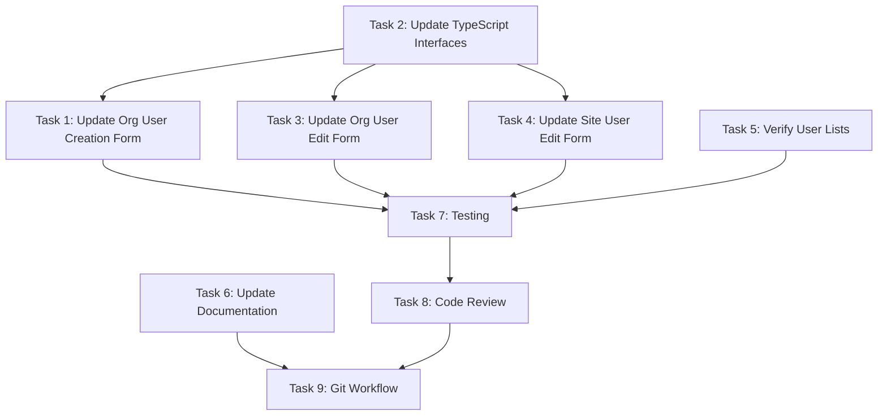

# Implementation Tasks

**Change ID:** `remove-enabled-from-user-creation`

This document outlines the specific implementation tasks required to completely remove the "enabled" property from all user management UI (creation and edit forms). The UI will never display or interact with the "enabled" field; all API calls will always set `enabled: true`.

## Task Checklist

### 1. Update Organization User Creation Form
**File:** `src/app/organization/[id]/users/new/page.tsx`

- [x] Remove `enabled` field from `FormData` interface (lines 18-25)
- [x] Remove `enabled: true` from initial `formData` state (lines 50-57)
- [x] Remove `enabled` field from API call payloads (lines 138, 149)
- [x] Remove the entire "Enabled" checkbox div section (lines 333-344)
- [x] Explicitly set `enabled: true` in both `createSiteUser` and `createUser` API calls

**Validation:**
- Verify form renders without "enabled" checkbox
- Test org user creation flow - user should be created with `enabled: true`
- Test site user creation flow - user should be created with `enabled: true`
- Verify no TypeScript errors

### 2. Update TypeScript Interfaces and API Services
**File:** `src/app/organization/services/api.ts`

- [x] Update `CreateUserPayload` interface to remove `enabled` field (line 100)
- [x] Update `createUser` function to explicitly set `enabled: true` in payload (line 111)
- [x] Update `createSiteUser` function payload type to remove `enabled` field (lines 677-684)
- [x] Update `createSiteUser` call to explicitly set `enabled: true` in payload
- [x] Update `updateUser` function to explicitly set `enabled: true` in the request payload
- [x] Update `updateSiteUser` function to explicitly set `enabled: true` in the request payload
- [x] Ensure all user-related API calls always include `enabled: true`

**Validation:**
- Run TypeScript type checking
- Verify no type errors in consuming components
- Verify all API functions set `enabled: true` explicitly

### 3. Update Organization User Edit Form
**File:** `src/app/organization/[id]/users/[userId]/edit/page.tsx`

- [x] Remove `enabled` field from `FormData` interface
- [x] Remove `enabled` from form state initialization
- [x] Remove the entire "Enabled" checkbox div section (lines 321-332)
- [x] Explicitly set `enabled: true` in the `updateUser` API call
- [x] Remove any references to `enabled` in form validation or state management

**Validation:**
- Verify form renders without "enabled" checkbox
- Test user update flow - user should be updated with `enabled: true`
- Verify no TypeScript errors

### 4. Update Site User Edit Form
**File:** `src/app/organization/[id]/sites/[siteId]/users/[userId]/edit/page.tsx`

- [x] Remove `enabled` field from `FormData` interface
- [x] Remove `enabled` from form state initialization
- [x] Remove the entire "Enabled" checkbox div section
- [x] Explicitly set `enabled: true` in the `updateSiteUser` API call
- [x] Remove any references to `enabled` in form validation or state management

**Validation:**
- Verify form renders without "enabled" checkbox
- Test site user update flow - user should be updated with `enabled: true`
- Verify no TypeScript errors

### 5. Verify User Lists Don't Display Enabled Status
**Files to check:**
- `src/app/organization/components/UsersTable.tsx`
- `src/app/organization/components/UserManagementTab.tsx`
- Any other components that display user lists

- [x] Check if "enabled" status is displayed in user tables/lists
- [x] Remove any "Enabled" or "Status" columns that show the enabled field
- [x] Remove any visual indicators (badges, icons) for enabled/disabled status
- [x] Ensure filtering by enabled status is removed (if present)

**Validation:**
- Browse user lists and verify no "enabled" status is shown
- Verify users appear normally regardless of backend `enabled` value

### 6. Update Documentation
**File:** `docs/Lawsome_PRD.md`

- [x] Document the change: "The 'enabled' property has been completely removed from the user management UI. All users are always treated as enabled from the UI perspective."
- [x] Update any user creation/edit screenshots or descriptions
- [x] Note that account suspension is not currently a UI feature
- [x] If account suspension becomes necessary, document that it should be implemented as a proper feature

**Validation:**
- Review documentation for accuracy
- Ensure no references to enabled/disabled users in UI documentation

### 7. Testing & Validation

#### Manual Testing
- [ ] Test creating organization user - verify no "enabled" checkbox, user created with `enabled: true`
- [ ] Test creating site user - verify no "enabled" checkbox, user created with `enabled: true`
- [ ] Test editing organization user - verify no "enabled" checkbox, user updated with `enabled: true`
- [ ] Test editing site user - verify no "enabled" checkbox, user updated with `enabled: true`
- [ ] Verify user lists display users normally (no enabled status shown)
- [ ] Test with different user roles (OrgAdmin, SiteAdmin, etc.)
- [ ] Verify workflow: create user → edit user → save (all successful without enabled field)

#### Backend Verification
- [ ] Verify API accepts requests with `enabled: true` in all calls
- [ ] Check database records show `enabled: true` for newly created users
- [ ] Check database records show `enabled: true` for updated users
- [ ] Verify no validation errors from backend
- [ ] Test with users that have `enabled: false` in backend - verify UI still displays them normally

#### Cross-Browser Testing
- [ ] Test in Chrome
- [ ] Test in Firefox
- [ ] Test in Safari (if applicable)
- [ ] Test in Edge

### 8. Code Review & Quality Checks
- [ ] Remove any unused imports related to `enabled` field
- [ ] Ensure consistent code formatting
- [ ] Verify no console errors in browser
- [ ] Check for any hardcoded references to `enabled` in all user forms and components
- [ ] Search codebase for references to `enabled` in user management context
- [ ] Run linter: `yarn lint`
- [ ] Build project successfully: `yarn build`

### 9. Git Workflow
- [ ] Create feature branch: `feature/remove-enabled-from-user-ui`
- [ ] Commit changes with descriptive message
- [ ] Push to remote
- [ ] Create pull request with reference to this proposal

## Task Dependencies

### Parallelizable Tasks
- Task 1, 3, 4, and 5 can be done in parallel (after Task 2)
- Task 6 can be done independently

### Sequential Dependencies
- Task 2 must be completed before Tasks 1, 3, 4
- Task 7 requires Tasks 1, 2, 3, 4, 5 to be complete
- Task 8 requires Task 7 to be complete
- Task 9 requires all other tasks to be complete

## Rollback Plan

If issues arise after deployment:

1. **Quick Rollback**: Revert the commit that removed the enabled field from UI
2. **Partial Rollback**: Keep creation forms simplified, restore only edit forms if needed
3. **Data Fix**: No data migration needed - all users created/updated during the change period will have `enabled: true`
4. **Backend Override**: If necessary, backend can still set `enabled: false` via direct database access or API calls

## Definition of Done

- [ ] All checkboxes in this document are checked
- [ ] User creation forms no longer display "enabled" checkbox
- [ ] User edit forms no longer display "enabled" checkbox
- [ ] User lists/tables no longer display "enabled" status
- [ ] All user creation API calls include `enabled: true`
- [ ] All user update API calls include `enabled: true`
- [ ] UI completely ignores `enabled` field from backend responses
- [ ] No TypeScript or linting errors
- [ ] Documentation updated
- [ ] Manual testing completed successfully
- [ ] Code reviewed and approved
- [ ] Changes merged to main branch

## Estimated Effort

- **Development**: 2-3 hours (4 pages to modify + API services)
- **Testing**: 1.5 hours (creation, edit, lists, backend verification)
- **Documentation**: 30 minutes
- **Code Review**: 45 minutes
- **Total**: ~5-6 hours
